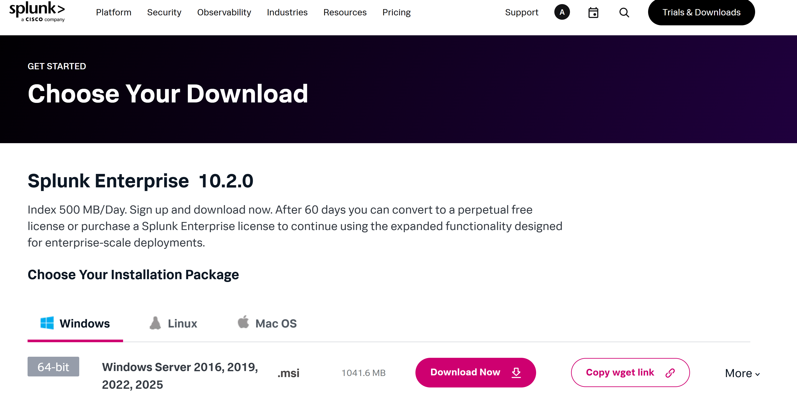

# Splunk SIEM Homelab: Detailed Implementation Report

## Overview
This project documents the end-to-end deployment, configuration, and operation of a Splunk Enterprise SIEM (Security Information and Event Management) platform on a standalone Windows host. The objective was to build a fully functional security monitoring environment from the ground up, ingesting local system telemetry and transforming it into actionable insights through custom queries and dashboards. This report details the technical steps taken, the rationale behind data source selection, and the creation of security-focused visualizations.

## 1. Deployment & Initial Configuration

### 1.1 Installation
*   **Software Acquisition:** Splunk Enterprise version 10.2.0 was downloaded directly from the official Splunk website.



*   **Local Installation:** The installation was performed by executing the `splunk.msi` installer on the Windows host, following the default setup wizard.
*   **Access:** Following installation, the Splunk Web interface was accessed locally via `http://localhost:8000`.
*   **Initial Login:** Upon first launch, the Splunk login screen was presented. Access was gained using the administrative credentials defined during the installation process.

## 2. Data Onboarding & Input Configuration
A critical phase involved configuring Splunk to collect relevant security and performance data from the host system.

### 2.1 Windows Event Logs
To establish foundational security visibility, Splunk was configured to ingest Windows Event Logs.
1.  From Splunk Home, the **Add Data** link was selected.
2.  The **Monitor** option was chosen to collect logs directly from the local machine.


   
3.  On the *Select Source* page, **Local Event Logs** was selected as the input type.
4.  Key Event Log Channels for security and system health monitoring were selected:
    *   `Security`
    *   `System`
    *   `Application`
5.  Input settings were reviewed and applied, assigning the data to the default `main` index.


### 2.2 Windows Performance Monitoring
To enable behavior-based anomaly detection, Splunk was configured to poll key Windows Performance Counters. This process was repeated for multiple performance objects.

#### **Process Object Configuration**
*   **Input Selection:** *Local Performance Monitoring* was selected from the data input menu.
*   **Collection Definition:** A unique name was assigned to this collection.
*   **Object & Counters:** The **`Process`** object was selected, followed by specific, security-relevant counters:
    *   `% Privileged Time`
    *   `Creating Process ID`
    *   `ID Process`
    *   `IO Write Bytes/sec` *(Key for researching ransomware encryption patterns)*
    *   `Private Bytes`
    *   `Thread Count`
    *   `Working Set`
*   **Target Instances:** Monitoring was focused on critical system processes:
    *   `System`
    *   `lsass`
    *   `services`
    *   `svchost` (and related instances `svchost#1`, `svchost#2`)
    *   `winlogon`
*   **Polling Interval:** 60.


#### **Network Interface & TCPv4 Objects**
The same configuration workflow was applied to two additional objects critical for network health and threat detection:
*   **`Network Interface`:** To monitor baseline traffic and detect anomalies (selected counters: `Bytes Sent/sec`, `Bytes Received/sec`).
*   **`TCPv4`:** To track connection states and identify potential network scans or failures (selected counters: `Connections Established`, `Connections Reset`, `Connection Failures`).

For each, relevant counters were selected and added to the `main` index.

## 3. Dashboard Development & Security Analysis
With data flowing into Splunk, custom Splunk Processing Language (SPL) queries were developed and saved as visualizations within a unified dashboard titled **"Basic dashboard showing monitored logs and system performance."**

### 3.1 Visualization 1: Network Traffic Analysis
*   **Purpose:** To establish a performance baseline and monitor for significant deviations in inbound/outbound traffic, which could indicate data exfiltration or malicious communication.
*   **Type:** Timechart Graph
*   **Timeframe:** `01/29/2026 16:55:00` to `01/30/2026 02:50:00`
*   **SPL Query:**
    ```sql
    index="main" object="Network Interface" (counter="Bytes Sent/sec" OR counter="Bytes Received/sec") earliest=01/29/2026:16:55:00 latest=01/30/2026:02:50:00
    | timechart span=5m avg(Value) by counter
    ```
*   **Output:** A line graph plotting the 5-minute average of bytes sent and received per second, providing a clear view of network activity over time.

### 3.2 Visualization 2: System Event Severity Triage
*   **Purpose:** To quickly quantify and prioritize system health issues by categorizing logged events by their severity level.
*   **Type:** Bar Chart
*   **Timeframe:** `01/29/2026` to `01/31/2026`
*   **SPL Query:**
    ```sql
    index="main" Type IN ("Warning", "Error", "Critical")
    | stats count as "Event Count" by Type
    | sort - "Event Count"
    ```
*   **Output:** A bar chart displaying the count of `Warning`, `Error`, and `Critical` events, enabling rapid assessment of system stability.

### 3.3 Visualization 3: TCP Connection Health Monitoring
*   **Purpose:** To identify potential network reconnaissance or instability by tracking the state of TCP connections. A surge in `Connections Reset` or `Connection Failures` can be indicative of scanning or denial-of-service probes.
*   **Type:** Timechart Graph
*   **Timeframe:** `01/30/2026:14:05:00` to `01/31/2026:03:45:00`
*   **SPL Query:**
    ```sql
    index="main" object="TCPv4" counter IN ("Connections Established", "Connections Reset", "Connection Failures") earliest="01/30/2026:14:05:00" latest="01/31/2026:03:45:00"
    | timechart span=5m avg(Value) by counter
    ```
*   **Output:** A multi-line graph showing the trend of established, reset, and failed connections, providing visibility into network session health.

## 4. Key Technical Insights & Real-World Application
*   **Strategic Data Selection:** The choice of performance counters was deliberate. For example, `IO Write Bytes/sec` was included specifically to explore its potential as an indicator for ransomware encryption activity, understanding that while useful, modern ransomware often employs tactics to evade such simple disk I/O detections.
*   **From Data to Detection:** The dashboards move beyond raw data presentation. The TCP connection graph, for instance, operationalizes a threat detection concept—anomalous connection resets could trigger an investigation for network scanning.
*   **End-to-End SIEM Workflow:** This project successfully demonstrated the complete lifecycle: **Installation -> Data Ingestion -> Query Development -> Visualization -> Security Analysis.**

## 5. Conclusion
This homelab project resulted in a fully operational Splunk SIEM instance capable of monitoring key security and performance facets of a Windows host. The process involved hands-on configuration of core data inputs, development of targeted SPL queries, and the creation of dashboards that translate technical telemetry into clear, actionable visual insights. The exercise solidifies foundational skills in SIEM engineering, log analysis, and the practical application of threat detection logic.

---
**Return to the project summary:** [README.md](./README.md)
